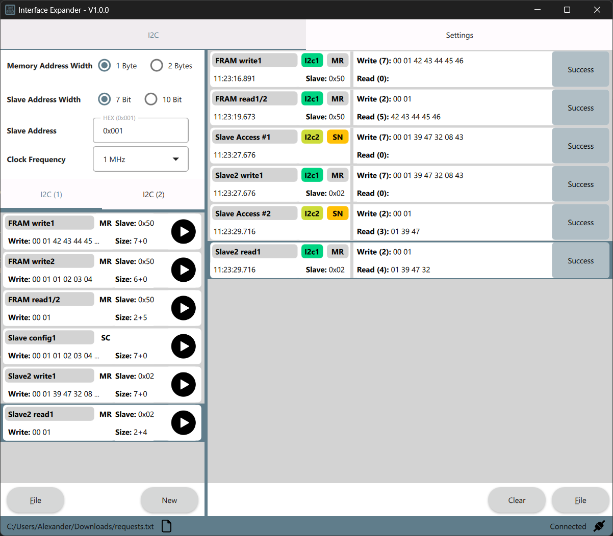

# Interface Expander - Control GUI

Welcome to the official repository of the **Interface Expander Control GUI**! 
This UI application allows you to interact with your Interface Expander device, 
providing a user-friendly interface for configuring and controlling the device.

You can find the device and more information on [Tindie](https://www.tindie.com/products/almcoding/usb-to-i2c-converter-with-gui/) :blush:

## Features

### Current Functionality
- **USB to I2C**: Seamlessly control two I2C masters and slaves
    - Configure I2C master write/read requests
    - Configure I2C slave memory data
    - Receive slave access notificaitons

### Upcoming Functionality (will added in a future release)
- **USB to SPI**: Seamlessly control two SPI masters/slaves

*Screenshot of the GUI Application*

## Getting Started

### Prerequisites
To use this application, you will need:
- A [USB Interface Expander](https://www.tindie.com/products/almcoding/usb-to-i2c-converter-with-gui/) device.
- A computer running Windows or Linux.

*Picture of USB Interface Expander*

### Installation
1. Download the latest release from the [Releases](https://github.com/AlmCoding/expander-ui/releases) page.
2. Follow the platform-specific installation instructions provided in the documentation.

### Usage
1. Connect your USB Interface Expander to your computer using a USB-C cable.
2. Launch the control application.
3. Use the intuitive interface to configure and interact with your device.

## Support
For any issues or feature requests, please open a ticket in the [Issues](https://github.com/AlmCoding/expander-ui/releases) section.

**Thank you for choosing the Interface Expander! Your feedback and suggestions are invaluable to us.**
