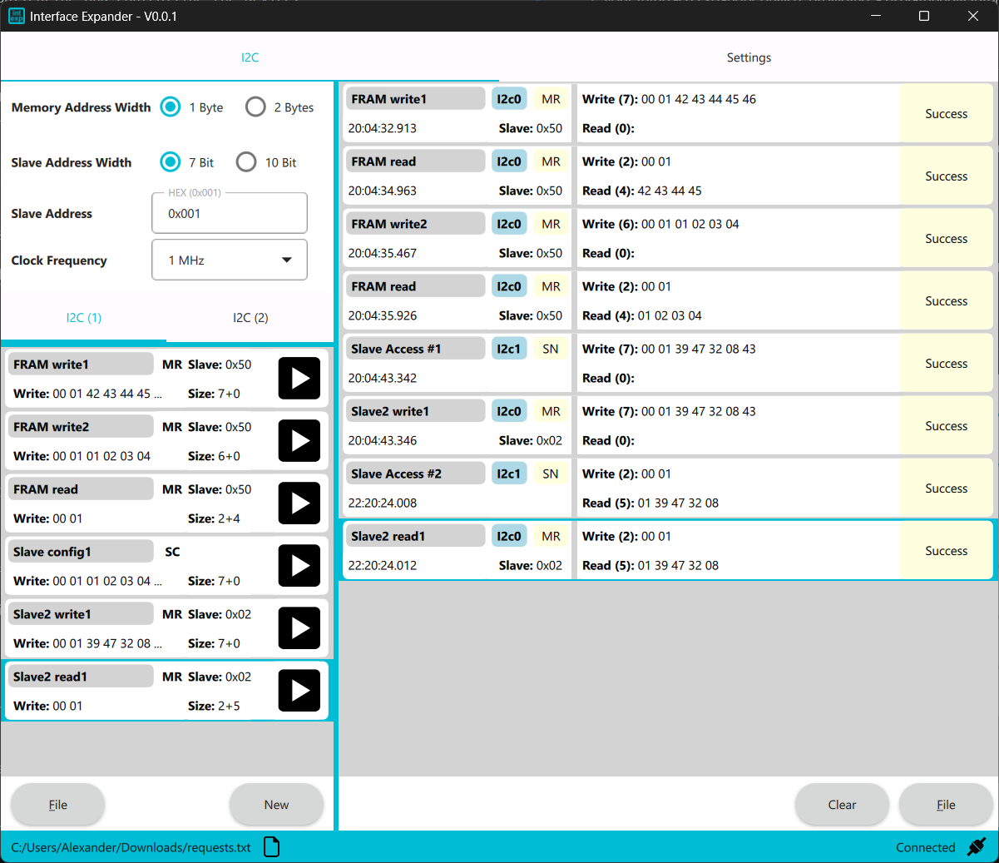

# Interface Expander GUI (Windows + Linux)

Welcome to the official repository of the **Interface Expander GUI**.  
This intuitive application provides a seamless way to interact with your Interface Expander device, offering an easy-to-use interface for configuring and managing its features.

You can find the device and more information on [Tindie](https://www.tindie.com/products/almcoding/usb-to-i2c-converter-with-gui/) :blush:

## 🧩 Features

### Current Functionality
- **USB to I2C**: Seamlessly control two I2C masters and slaves
    - Configure I2C master write/read requests
    - Configure I2C slave memory data
    - Receive slave access notifications

### Upcoming Functionality (will be added in the future)
- **USB to SPI**: Seamlessly control two SPI masters/slaves  


*Screenshot of the GUI Application*

## 🚀 Getting Started

### ✅ Prerequisites
To use this application, you will need:
- A [USB Interface Expander](https://www.tindie.com/products/almcoding/usb-to-i2c-converter-with-gui/) device.
- A computer running Windows or Linux.


*Picture of USB Interface Expander*

### 📦 Installation
1. Download the latest release from the [Releases](https://github.com/AlmCoding/expander-ui/releases) page.
2. On Linux:
    - Run the **linux_setup.sh** script to ensure proper serial port access rights.
    - Install dependencies  
        **Ubuntu/Debian**
        ```
        sudo apt install libxcb-cursor0
        ```
        **Fedora**
        ```
        sudo dnf install xcb-util-cursor
        ```
        **Arch Linux**
        ```
        sudo pacman -S xcb-util-cursor
        ```
3. Run the application

### ▶️ Usage
1. Connect your USB Interface Expander to your computer using a USB-C cable.
2. Launch the control application.
3. Use the intuitive interface to configure and interact with your device.

## 🤝 Support
For any issues or feature requests, please open a ticket in the [Issues](https://github.com/AlmCoding/expander-ui/issues) section.

**Thank you for choosing the Interface Expander! Your feedback and suggestions are appriciated.**
